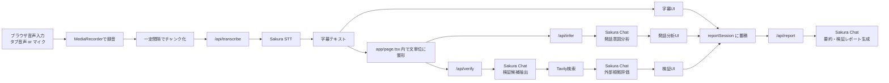

# 空気の裏字幕 / IMPACT IN FACT Webアプリ 説明書

## これは何をするアプリか

このアプリは、動画や会議の音声を取り込み、以下をまとめて行うための Next.js 製Webアプリです。

- 音声の文字起こし
- 発話ごとの意図推定
- 発言内容の外部検証候補の抽出
- 外部検索に基づく簡易的な裏取り
- セッション全体の要約と検証レポート生成
- 一部パネルのポップアップ分離表示

UI上の名前は「空気の裏字幕」で、英名は「IMPACT IN FACT」です。

## 技術スタック

- フレームワーク: Next.js App Router
- 言語: TypeScript
- UI: React + Tailwind CSS
- 音声取得: `MediaRecorder`, `getDisplayMedia`, `getUserMedia`
- 文字起こし/LLM分析: Sakura AI API
- 外部検索: Tavily API

依存はかなり少なく、実装の中心は自前ロジックです。

## 全体アーキテクチャ

## ディレクトリ構成

### 画面

- `app/page.tsx`
  - アプリの本体です。
  - 録音、状態管理、字幕更新、推論キュー、検証キュー、レポート生成、ポップアップ連携までほぼすべてを担当しています。
- `app/layout.tsx`
  - 全体レイアウトとメタデータ設定です。
- `app/popup/page.tsx`
  - ポップアップ画面のデフォルト遷移です。
- `app/popup/[panel]/page.tsx`
  - 分離表示用の各パネルを表示します。

### API

- `app/api/transcribe/route.ts`
  - 音声ファイルを Sakura の音声認識 API に転送します。
- `app/api/infer/route.ts`
  - 発話意図と「伝え方の強さ」を推定します。
- `app/api/verify/route.ts`
  - 検証すべき話題を抽出し、必要に応じて Tavily で外部検索して根拠評価まで行います。
- `app/api/report/route.ts`
  - セッション全体から要約と検証レポートを生成します。
- `app/api/assistant/route.ts`
  - 現在の文脈を踏まえた質問応答を行います。

### UIコンポーネント

- `components/CaptureControls.tsx`
  - コンテンツ種別、言語、分析メモ、録音操作を担当します。
- `components/TranscriptPanel.tsx`
  - 通常字幕の一覧です。
- `components/IntentPanel.tsx`
  - 発話分析の一覧です。
- `components/VerificationAssistantPanel.tsx`
  - 最新の検証結果を詳しく表示します。
- `components/AnalysisAssistantPanel.tsx`
  - ユーザーが追加質問できるチャットUIです。
- `components/AudioSummaryWidget.tsx`
  - セッション全体の要約を表示します。
- `components/ReportPanel.tsx`
  - 検証レポートの保存と閲覧を担当します。
- `components/PopupPanelClient.tsx`
  - 分離表示パネルの受信側UIです。
- `components/LatestTranscriptPanel.tsx`
  - ポップアップ用の最新字幕表示です。
- `components/LatestIntentPanel.tsx`
  - ポップアップ用の最新発話分析表示です。

### ライブラリ

- `lib/sakura.ts`
  - Sakura API の設定取得と共通 fetch です。
- `lib/tavily.ts`
  - Tavily 検索の実行です。
- `lib/prompts.ts`
  - 発話分析用プロンプトです。
- `lib/verifyPrompts.ts`
  - 検証候補抽出と外部根拠評価用プロンプトです。
- `lib/reportPrompts.ts`
  - レポート生成用プロンプトです。
- `lib/assistantPrompts.ts`
  - 分析アシスタント用プロンプトです。
- `lib/validators.ts`
  - LLMのJSON応答を安全に正規化する処理です。
- `lib/verify.ts`
  - 検証結果と外部根拠結果の正規化です。
- `lib/audio.ts`
  - `MediaRecorder` の対応 MIME type 選択です。
- `lib/popup.ts`
  - 分離表示ウィンドウの設定です。

### 型定義

- `types/inference.ts`
- `types/verification.ts`
- `types/report.ts`
- `types/popup.ts`

データの流れを理解したい場合は、まずここを見ると整理しやすいです。

## 画面の使い方と意味

### 1. 設定エリア

最初にユーザーは以下を設定します。

- コンテンツ種別
  - YouTube動画、オンライン会議、セミナーなど
- 入力言語
  - 自動、日本語、英語
- 分析メモ
  - 何を重視して分析したいか
- 音声取得方法
  - タブ音声 or マイク

この中で特に重要なのが「分析メモ」です。これが空だと録音を開始できません。

### 2. 録音開始後の表示

Start 後は以下が順に更新されます。

- 直前の分析
  - 最新発話に対する意図推定
- 検証アシスト
  - 最新発話について「要確認か」「一致の可能性があるか」など
- 通常字幕
  - 確定した字幕の履歴
- 発話分析
  - 文ごとの分類結果
- 分析アシスタント
  - 現在の文脈について質問可能
- 音声要約 / 検証レポート
  - Stop後に全体をまとめ直せる

### 3. ポップアップ分離表示

右上メニューから以下を別ウィンドウに出せます。

- リアルタイム字幕
- リアルタイム発話分析
- 検証アシスタント
- 分析アシスタント

これは `BroadcastChannel` と `localStorage` を使って、親画面の状態スナップショットを共有しています。

## 実際の処理フロー

### 1. 音声取得

音声取得方法は2種類です。

- タブ音声
  - `navigator.mediaDevices.getDisplayMedia({ video: true, audio: true })`
- マイク入力
  - `navigator.mediaDevices.getUserMedia({ audio: ... })`

取得した音声トラックだけを抜き出し、`MediaRecorder` で録音しています。

### 2. チャンク化

実装上は `CHUNK_MS = 2000` なので 2 秒ごとに録音を区切ります。ただしそのまま毎回送っているわけではなく、`SEND_EVERY_CHUNKS = 2` なので 2チャンクをまとめてから `/api/transcribe` に送っています。

つまり、文字起こしAPIへの送信単位は通常およそ 4 秒分です。

### 3. 音量と無音判定

`AnalyserNode` を使って以下を継続的に計算しています。

- RMS
  - 音の大きさ
- ZCR
  - 波形の変化量

これを使って、

- 入力レベル表示
- 無音に近いチャンクのスキップ
- 声の勢い、速さ、変化量の簡易推定

を行っています。

### 4. 文字起こし

`/api/transcribe` は受け取った音声ファイルを Sakura STT に転送します。返ってきたレスポンス形式が複数あり得る前提で、以下の候補からテキストを抽出しています。

- `payload.text`
- `payload.transcription`
- `payload.result`
- `payload.data.text`
- `payload.results[0].text`
- `payload.segments[].text`

つまり「APIレスポンス形式が多少揺れても拾う」作りです。

### 5. 字幕の整形

`app/page.tsx` 側で文字起こし結果をそのまま出さず、少し整えています。

- 前回までの未確定発話と結合
- 日本語らしい読点の自動補完
- 句点や感嘆符で文分割
- 長すぎる未確定文は読点位置でソフト分割
- 無音が続いたら未確定発話を確定

このため、UIには

- 確定済み字幕
- 話途中の暫定字幕

の2種類が存在します。

### 6. 発話分析

文が確定するたび、または未確定でも十分長くなった段階で `/api/infer` を呼びます。

ここで Sakura Chat に渡している材料は以下です。

- 現在の発話
- 直近の文脈
- セッション全体の最近の文脈
- コンテンツ種別
- 分析メモ
- 音声特徴量

結果は以下です。

- `intent_label`
  - 主張、説明、注意喚起、意見・宣伝、確認・保留、情報不足、判断困難
- `intent_note`
  - 短い説明
- `temperature`
  - 伝え方の強さを 5 段階で表現
- `confidence`

英語入力っぽい場合は、分析結果の `utterance` を日本語訳として採用する作りになっています。UI上で一時的に `翻訳中...` と表示されるのはこのためです。

### 7. 検証処理

発話ごとに `/api/verify` も呼ばれますが、条件があります。

- 録音中のみ有効
- ある程度の文字数が必要
- キュー間隔あり
- 同じ内容の連続判定は抑制

内部では2段階あります。

### 7-1. 検証候補の抽出

まず Sakura Chat に対して、

- この発話は公開情報で調べるべきか
- 何を調べるべきか
- 機密・個人情報なので除外すべきか

を JSON で返させています。

結果として、

- `status`
  - `needs_research`, `likely_ok`, `uncertain`, `out_of_scope`
- `public_topics`
- `suggested_queries`
- `excluded`

が得られます。

### 7-2. 外部検索と根拠評価

`status !== out_of_scope` の場合だけ、さらに外部根拠確認を行います。

流れは以下です。

1. `suggested_queries` と `public_topics` から検索語を構築
2. Tavily で検索
3. 上位結果を URL 単位で重複排除
4. 検索結果スニペットを再度 Sakura Chat に渡す
5. 各主張を `supported / contradicted / mixed / insufficient / unavailable` に分類

つまりこのアプリは、Webを直接読んで自前判定しているのではなく、

- Tavily で検索候補を集める
- Sakura Chat にその検索結果を要約評価させる

という2段構えです。

### 8. セッション蓄積

アプリは毎回の発話をただ表示しているだけではなく、`reportSession` に蓄積しています。

`reportSession` には以下が入ります。

- Clear 時刻
- 最初の Start 時刻
- 最後の Stop 時刻
- Start/Stop 区間の一覧
- 字幕一覧
- 発話分析一覧
- 検証一覧

重要なのは、レポート対象が「Clear 後の最初の Start から」だという点です。途中で Stop / Start を挟んでも、Clear しない限り同じ分析セッションとして継続されます。

### 9. レポート生成

`レポート生成` または `要約・検証更新` を押すと `/api/report` が呼ばれます。

入力は `reportSession` 全体です。出力は以下です。

- タイトル
- 音声全体の要約
- トピック一覧
- 検証の全体まとめ
- 疑うべき点
- 肯定寄りに確認できた点
- 否定寄りに確認できた点
- 未解決の確認事項
- ダウンロード用 Markdown

また、Sakura が使えない場合でも、コード内のフォールバックで最低限のレポートを組み立てる作りになっています。

## 状態管理の特徴

このアプリの状態管理はかなり `app/page.tsx` に集中しています。React のローカル state と `useRef` が主で、外部状態管理ライブラリは使っていません。

主な state は以下です。

- 録音状態
- 字幕一覧
- 発話分析一覧
- 検証一覧
- アシスタント会話
- レポート状態
- ポップアップ表示状態
- 推論キュー状態

主な `ref` は以下です。

- `mediaRecorderRef`
- `mediaStreamRef`
- `transcriptRef`
- `inferenceRef`
- `verificationRef`
- `inferenceQueueRef`
- `verifyQueueRef`
- `reportSessionRef`

つまり「画面表示用 state」と「非同期処理中でも即時参照したい最新値」を分けるために、`useState` と `useRef` を併用しています。

## APIごとの責務

### `/api/transcribe`

- 音声ファイルを受ける
- Sakura STT へ転送
- 返却形式の揺れを吸収して `text` を返す

### `/api/infer`

- 発話意図分析専用
- プロンプトで厳密に JSON 出力を要求
- 返却値を `normalizeInference` で丸める

### `/api/verify`

- 公開情報で確認すべきかを判定
- 必要なら Tavily 検索
- 検索結果スニペットをもとに外部根拠を評価

### `/api/report`

- セッション全体のレポート生成
- モデル不調時はフォールバックレポートを返す
- ダウンロード用 Markdown も生成

### `/api/assistant`

- 現在の分析状態を踏まえた質問応答
- 自前検索はせず、既存の検証結果だけを参照

## 環境変数

このアプリで使っている環境変数は以下です。

- `SAKURA_AI_API_KEY`
- `SAKURA_AI_BASE_URL`
- `SAKURA_STT_MODEL`
- `SAKURA_CHAT_MODEL`
- `TAVILY_API_KEY`
- `NODE_ENV`

意味は以下です。

- Sakura 系
  - 文字起こしとチャット分析に必須
- Tavily
  - 外部検索を有効にするために必要

`TAVILY_API_KEY` が無い場合でもアプリは動きますが、外部照合は「未実行」扱いになります。

## このアプリの設計上の特徴

### 1. ほぼフロント主導

このアプリはサーバーに永続保存する構成ではありません。録音・字幕・分析の主導権はブラウザ側にあります。

サーバー側は主に、

- 外部APIへの中継
- LLMへのプロンプト整形
- 返却JSONの整形

をしています。

### 2. データベースがない

セッションデータはメモリ上です。ページ再読み込みやタブを閉じると、基本的にメイン画面の状態は失われます。

ポップアップ連携のために `localStorage` にスナップショットを入れていますが、これは本格的な復元機構ではありません。

### 3. かなり単一ファイル集中型

実質的なアプリケーション本体は `app/page.tsx` です。ここに

- 録音
- 字幕確定
- 発話分析
- 検証
- レポート
- ポップアップ連携

が集まっています。

理解のしやすさという点では「入口が1箇所」というメリットがありますが、今後大きくすると分割した方が保守しやすくなります。

## コードを読む順番のおすすめ

このアプリを理解するなら、次の順で読むのが効率的です。

1. `types/report.ts`
2. `types/inference.ts`
3. `types/verification.ts`
4. `app/page.tsx`
5. `app/api/transcribe/route.ts`
6. `app/api/infer/route.ts`
7. `app/api/verify/route.ts`
8. `app/api/report/route.ts`
9. `lib/prompts.ts`, `lib/verifyPrompts.ts`, `lib/reportPrompts.ts`

最初に型を見ると、あとから `app/page.tsx` を読んだときに状態の意味がかなり追いやすくなります。

## 現状の注意点

### 1. 表示と実装の更新周期に少し差がある

フッター文言では「2秒ごとに更新」と読めますが、実際の STT 送信は通常 2チャンクまとめなので約4秒単位です。

### 2. 使われていないコンポーネントがある

以下のコンポーネントは存在しますが、現在の `app/page.tsx` では描画されていません。

- `components/ContentTrustMeter.tsx`
- `components/TemperatureMeter.tsx`

途中で作られたが現UIにはまだ組み込まれていない機能と考えられます。

### 3. `sessionId` は現状ほぼ識別用だけ

フロントから `sessionId` をAPIに送っていますが、APIルート側ではほとんど使っていません。現状は将来拡張の名残か、ログ識別用の途中実装に近い状態です。

### 4. 検証は万能ではない

外部照合は、

- Tavily の検索結果
- その検索結果スニペット

に強く依存します。リンク先本文を精読しているわけではないので、最終判断は必ず人手確認が必要です。

## まとめ

このアプリは一言でいうと、

「ブラウザで音声を取り込み、Sakura AI と Tavily を使って、字幕・発話意図・検証・要約をひと続きで行う音声分析ダッシュボード」

です。

実装の中心は `app/page.tsx` にあり、そこから

- `/api/transcribe`
- `/api/infer`
- `/api/verify`
- `/api/report`
- `/api/assistant`

へ必要に応じてリクエストを投げています。

今後さらに理解を深めるなら、次は `app/page.tsx` を

- 録音部分
- 字幕整形部分
- 推論キュー部分
- 検証キュー部分
- レポート部分

に分けて読むと全体がつかみやすいです。
